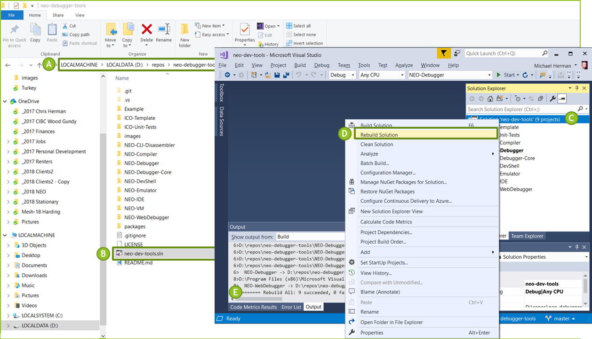

# Workshop for programming smart contracts with .NET, C# and Visual Studio

[NEO Blockchain C# Developers Center of Excellence](https://github.com/mwherman2000/neo-csharpcoe/blob/master/README.md)

## Workshop for programming smart contracts with .NET, C# and Visual Studio

The original idea as well as the structure, and content of this workshop was created by Chris Hager (@metachris) for the NEO Python community: [Workshop for programming smart contracts with Python (python-smart-contract-workshop)](https://github.com/CityOfZion/python-smart-contract-workshop) ([https://github.com/CityOfZion/python-smart-contract-workshop](https://github.com/CityOfZion/python-smart-contract-workshop)).

This C# version of the workshop, [Workshop for programming smart contracts with .NET, C# and Visual Studio (csharp-smart-contract-workshop)](https://github.com/mwherman2000/csharp-smart-contract-workshop) ([https://github.com/mwherman2000/csharp-smart-contract-workshop](https://github.com/mwherman2000/csharp-smart-contract-workshop)), is a parallel effort based on Chris's original [workshop content](https://github.com/CityOfZion/python-smart-contract-workshop) (March 2018).

## Purpose

* Hands-on smart contract development workshop: .NET/C#/Visual Studio on the NEO Blockchain

## Goals, Non-Goals and Assumptions

* Target audience: Architects and Developers who are new to the NEO Blockchain platform
* Background: Very little or no previous NEO or .NET/C#/Visual Studio Experience
* Background: Understand basic 1st and 2nd generation blockchain technologies: hashing, blocks, mining, etc.
* Provide you with a basic level of awareness and understanding of NEO smart contract development
* Help create a strong NEO Blockchain Developer community – helping each other

## Principles

* Provide reliable documentation: timely, accurate, visual, and complete
* Save as much of a person's time as possible
* Use open source software whenever possible

## Drivers

* Need in the NEO .NET developer community to have concise and easy-to-follow documentation to enable people to get up to speed developing NEO smart contracts in as short a time as possible

## Workshop Content

* [Preparation](https://github.com/mwherman2000/csharp-smart-contract-workshop#preparation)
* [Workshop Content](https://github.com/mwherman2000/csharp-smart-contract-workshop#course-content)
* [Labs and Solutions](https://github.com/mwherman2000/csharp-smart-contract-workshop#labs-and-solutions)
* [Other Resources](https://github.com/mwherman2000/csharp-smart-contract-workshop#other-resources)
* [Comments and Feedback](https://github.com/mwherman2000/csharp-smart-contract-workshop#comments-and-feedback)

### Preparation

1. Join Discord NEO Developer Community on Discord by clicking on one of the following links: 
   * https://discord.gg/gqCYeup or https://discord.gg/4TQujHj 
2. Download and install Microsoft Visual Studio Community Edition 2017. This version is free to download and free to use. It is an excellent IDE for C# smart contract development from here: 
   * https://www.visualstudio.com/vs/community/
3. Download and install the .NET 4.7.1 Dev Pack from here:
   *  https://www.microsoft.com/en-us/download/details.aspx?id=56119
4. Build the NEO Debugger Tools
   * Download the NEO Debugger Tools source code from here:    
      * https://github.com/mwherman2000/neo-debugger-tools/archive/master.zip
   * Create a new folder on your hard drive – for example `c:\repos`   
   * Copy `master.zip` into `c:\repos`.
   * Unzip `master.zip` and build the NEO Debugger Tools following the steps in the diagram below.

       

5. Lastly, update your Windows PATH environment variable to include the path to the NEO Compiler `neon.exe` by typing the following into the Windows command prompt:

```
setx PATH="C:\repos\neo-debugger-tools\NEO-Compiler\bin\Debug";%PATH%
```

**NOTE** Use the `setx` command - not the `set` command.

**NOTE** If you unzipped `master.zip` into a different folder or onto a different hard drive, change the `setx` command to use the folder you chose. 


### Course Content

[](./Docs/NEO%20Enterprise%20dApp%20Workshop-Ankara-2018-04-02.pdf)

### Labs and Solutions

* Module 1: Runtime.Log(), Runtime.Notify(), and NEO Storage

    * [Lab 1 - lab1_log.cs](./csharp-examples/lab1_log/lab1_log.cs) - click [here](./csharp-examples/lab1_log/lab1_log.cs) for the solution
    * [Lab 2 – lab2_logandnotify.cs](./csharp-examples/lab2_logandnotify/lab2_logandnotify.cs) - click [here](./csharp-examples/lab2_logandnotify/lab2_logandnotify.cs) for the solution
    * [Lab 3 – lab3_storage.cs](./csharp-examples/lab3_storage/lab3_storage.cs) - click [here](./csharp-examples/lab3_storage/lab3_storage.cs) for the solution

* Module 2: NEO Smart Contract Patterns

   * [Lab 4 – lab4_processoperationpattern.cs](./csharp-examples/lab4_processoperationpattern/lab4_processoperationpattern.cs) - click [here](./csharp-examples/lab4_processoperationpattern/lab4_processoperationpattern.cs) for the solution
   * [Lab 5 – lab5_domain.cs](./csharp-examples/lab5_domain/lab5_domain.cs) - click [here](./csharp-examples/lab5_domain/lab5_domain.cs) for the solution
   * [Lab 6 – lab6_NEP5pattern.cs](./csharp-examples/lab6_NEP5pattern/lab6_NEP5pattern.cs) - click [here](./csharp-examples/lab6_NEP5pattern/lab6_NEP5pattern.cs) for the solution


### Other Resources

* [NEO Blockchain C# Developers Center of Excellence (neo-csharpcoe)](https://github.com/mwherman2000/neo-csharpcoe/blob/master/README.md)
   * [`neo-csharpcoe` "Top 10" List of Resources for C#.NEO Developers](https://github.com/mwherman2000/neo-csharpcoe/blob/master/README.md#neo-csharpcoe-top-10-list-of-resources-for-cneo-developers)

* [NEO Blockchain Quick Start Guide for .NET Developers](https://github.com/mwherman2000/neo-dotnetquickstart/blob/master/README.md)

* [Workshop for programming smart contracts with Python (python-smart-contract-workshop)](https://github.com/CityOfZion/python-smart-contract-workshop) 

### Comments and Feedback

If you have any issues or ideas for improvements, please leave your feedback on the [GitHub Repository](https://github.com/mwherman2000/csharp-smart-contract-workshop) and in the #csharp channel in [NEO Discord Group](https://discord.gg/R8v48YA).


## What is the [NEO Blockchain C# Developers Center of Excellence](https://github.com/mwherman2000/neo-csharpcoe/blob/master/README.md)?

The `neo-csharpcoe` project is an "umbrella" project for several initiatives related to providing tools and libraries (code), frameworks, how-to documentation, and best practices for Enterprise Distributed Application development using .NET/C#, C#.NEO and the NEO Blockchain software platform.

The `neo-csharpcoe` is an independent, free, open source project that is 100% community-supported by people like yourself through your contributions of time, energy, passion, promotion, and donations.

To learn more about contributing to the `neo-csharpcoe`, click [here](https://github.com/mwherman2000/neo-csharpcoe/blob/master/CONTRIBUTE.md).